# Task 1 — Manual Testing Bug Report

**Pages tested:** Admin Settings · Contacts  
**Date:** 2026-07-27  
**Tester:** Automated exploration (Playwright) + analysis  

---

## Admin Settings

### BUG-001 · High — Budgeting data resets between sessions
**Section:** Budgeting → Allocation categories  
**Description:** On the previous session the categories were `education ($10,000)`, `help ($11,000)`, `environment ($0)` and Total Allocated showed `$21,000`. After re-logging in, all categories are gone — only an empty "Add" row is shown and Total Allocated shows `$0`. The budget data was not persisted.  
**Steps:**
1. Log in and go to Admin Settings
2. Add allocation categories with amounts and navigate away
3. Log back in and return to Admin Settings → Budgeting
**Expected:** Categories persist  
**Actual:** All categories reset to empty

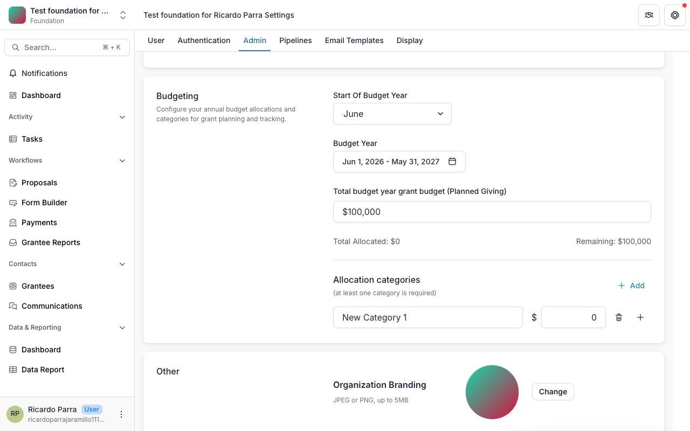

---

### BUG-002 · High — Last allocation category can be removed (validation not enforced)
**Section:** Budgeting → Allocation categories  
**Description:** The UI shows the note *"(at least one category is required)"* but the Remove button stays active even when only one category remains, allowing a state with zero categories.  
**Steps:**
1. Reduce categories to 1 by removing all others
2. Click Remove on the last one
**Expected:** Remove button disabled or error shown  
**Actual:** Last category is removed with no warning

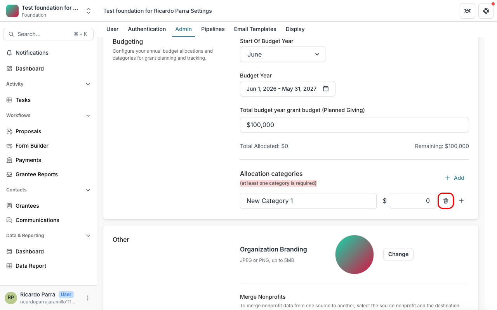

---

### BUG-003 · Medium — Two MFA toggles share the same `id` (`field-:r2c:`)
**Section:** Other → Multi Factor Authentication  
**Description:** Both "Require MFA for all grantees" and "Require MFA for all foundation users" checkboxes have the same HTML `id`. This breaks label association and can cause one toggle to accidentally trigger the other when clicking its label.  
**Steps:** Inspect DOM of the MFA section  
**Expected:** Each checkbox has a unique `id`  
**Actual:** Both share `id="field-:r2c:"`

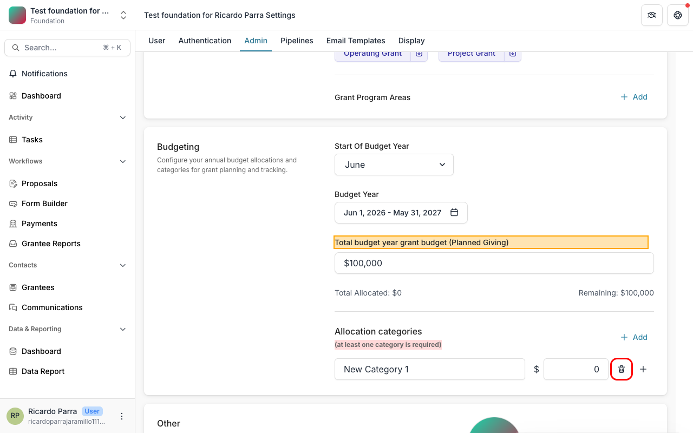

---

### BUG-004 · Medium — Three "Assigned To Me Configuration" checkboxes share the same `id`
**Section:** Other → Assigned To Me Configuration  
**Description:** All three checkboxes (Viewers, Upcoming Task, Grant Primary Contact) share `id="field-:r2f:"`. Same duplicate-id issue as BUG-003.  
**Steps:** Inspect DOM of the Assigned To Me Configuration section  
**Expected:** Each checkbox has a unique `id`  
**Actual:** All three share `id="field-:r2f:"`

*(See BUG-003/004 screenshot above — both bugs are in the same DOM region)*

---

### BUG-005 · Medium — "Total budget year grant budget" label says "(Planned Giving)"
**Section:** Budgeting  
**Description:** The label reads *"Total budget year grant budget (Planned Giving)"*. The parenthetical "(Planned Giving)" is unexplained — it's unclear if this field only applies to Planned Giving grants or if it's a leftover from a previous feature.  
**Severity:** Medium (confusing UX / misleading label)

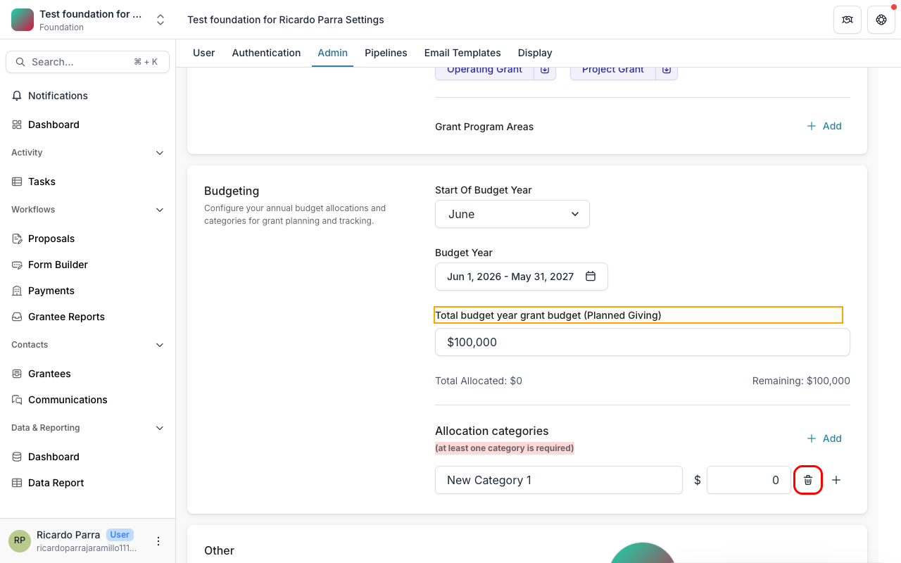

---

### BUG-006 · Medium — Fiscal year navigation chevron buttons have no accessible text
**Section:** Budgeting → Budget Year menu  
**Description:** The "previous year" and "next year" chevron buttons (`<` `>`) inside the fiscal year dropdown have no `aria-label`, `title`, or visible text.  
**Expected:** `aria-label="Previous years"` / `aria-label="Next years"`  
**Actual:** Empty buttons inaccessible to screen readers

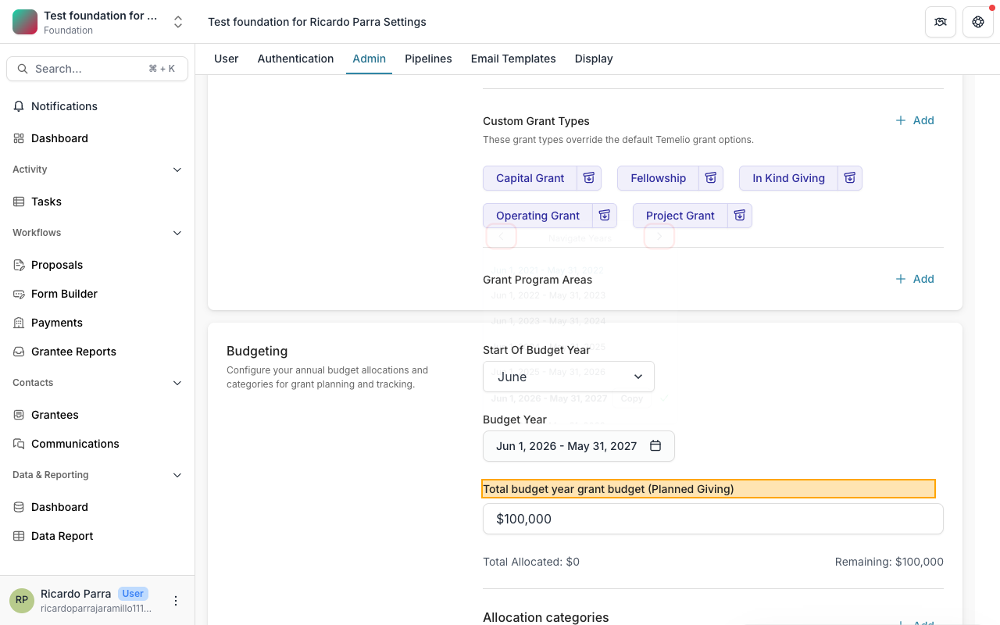

---

### BUG-007 · Low — Archive Grant Type buttons have no visible label text
**Section:** Global Configurations → Custom Grant Types  
**Description:** The archive buttons next to each grant type only contain an icon (no text). They do have `aria-label="Archive Grant Type"` which is correct for screen readers, but hovering shows no tooltip confirming the action for sighted users.  
**Severity:** Low (aria-label present, but no tooltip)

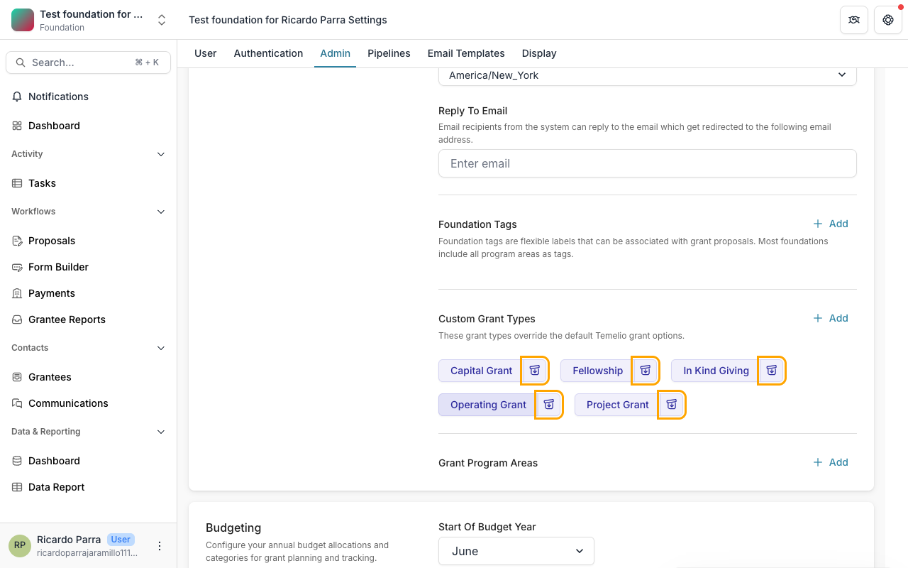

---

### BUG-008 · Low — `Merge Nonprofits` button is active before selecting Destination Entity
**Section:** Other → Merge Nonprofits  
**Description:** Source Entity select is empty, Destination Entity is disabled until source is chosen — but `Merge Nonprofits` button appears to be clickable (no `disabled` attribute detected). Clicking it with no selection should be blocked.  
**Steps:**
1. Go to Merge Nonprofits section without selecting any entity
2. Attempt to click "Merge Nonprofits"
**Expected:** Button disabled until both entities are selected  
**Actual:** Button is not disabled with empty source

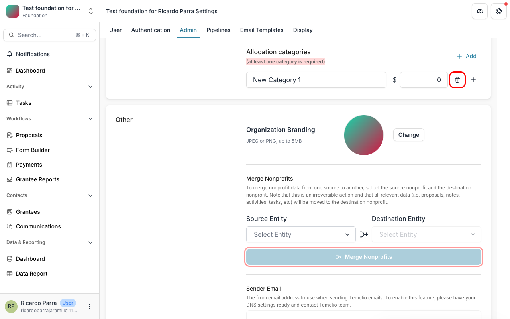

---

### BUG-009 · Low — Console warns about deprecated Tailwind CSS color names
**Section:** App-wide  
**Description:** 5 Tailwind deprecation warnings appear on every page load (`lightBlue → sky`, `warmGray → stone`, `trueGray → neutral`, `coolGray → gray`, `blueGray → slate`). Not a runtime bug but indicates outdated config.

---

## Contacts

### BUG-010 · High — Console errors: invalid `href` with double slashes
**Section:** Contacts page (Grantees / People tabs)  
**Description:** Two JS errors logged on load:
- `Invalid href '/foundation//contacts'` 
- `Invalid href '/foundation//individuals'`

The `foundationId` is empty in these generated URLs — likely a race condition where the component renders before the foundation ID is available in context.  
**Steps:** Open the Contacts page and check browser console  
**Expected:** No console errors  
**Actual:** Two `next/router` invalid-href errors on every load

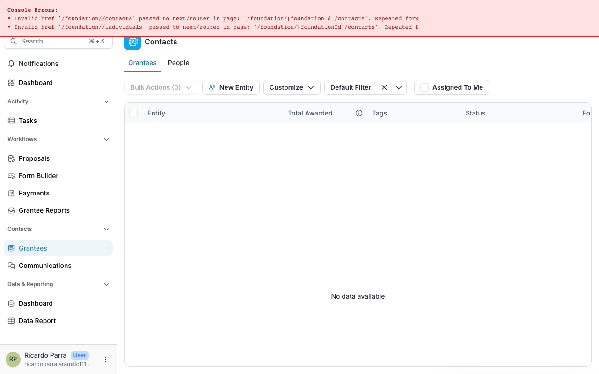

---

### BUG-011 · Medium — Contacts table shows "No data available" with no explanation
**Section:** Contacts → Grantees tab  
**Description:** The table displays "No data available" but there is no indication of whether this is expected (empty foundation) or a load failure. No empty-state illustration, no CTA to add the first contact.  
**Severity:** Medium (poor empty-state UX)

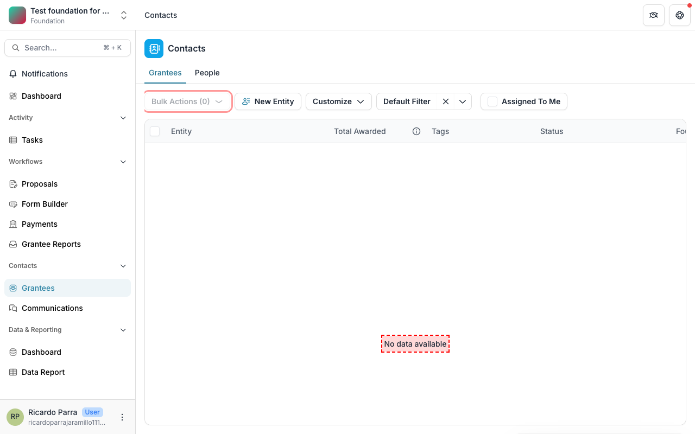

---

### BUG-012 · Medium — "Bulk Actions (0)" button is always visible even with no data
**Section:** Contacts toolbar  
**Description:** The "Bulk Actions (0)" button is shown even when the table has no rows and no items are selected. It should be hidden or disabled when there is nothing to act on.

*(See BUG-011/012 screenshot above)*

---

### BUG-013 · Medium — Two checkboxes in Contacts table have no `id` and no label
**Section:** Contacts → table header / row checkboxes  
**Description:** The "select all" and row-level checkboxes have no `id`, no `aria-label`, and no associated `<label>`. They are inaccessible to screen readers.

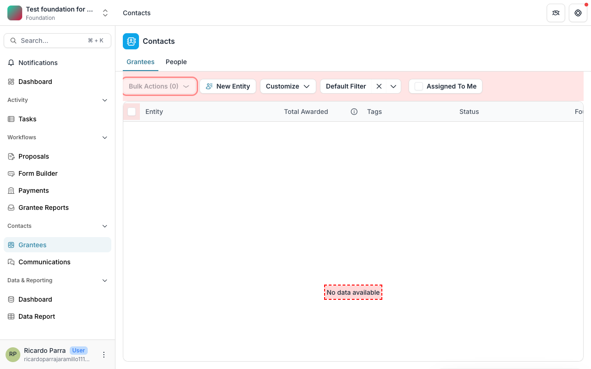

---

### BUG-014 · Low — "Clear filter" button visible when no filter is active
**Section:** Contacts toolbar  
**Description:** A "Clear filter" button (×) is visible even though no active filter has been applied by the user. It should only appear when a filter is active.

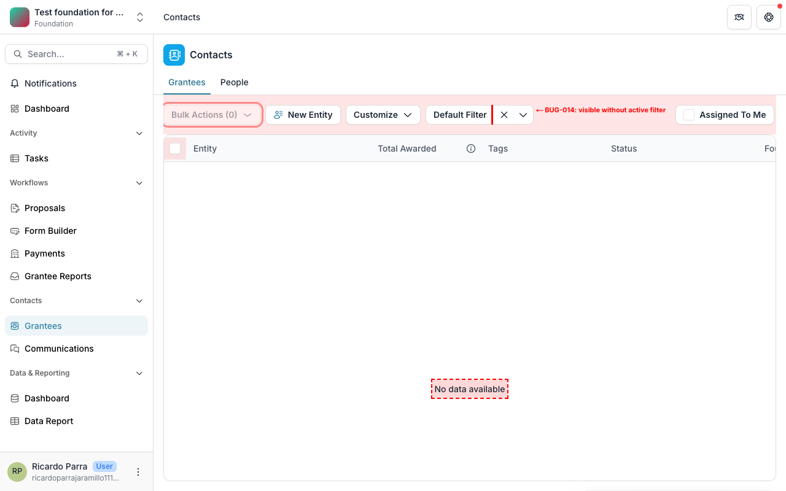

---

## Summary

| Bug ID | Page | Severity | Title |
|--------|------|----------|-------|
| BUG-001 | Admin | High | Budgeting data resets between sessions |
| BUG-002 | Admin | High | Last category can be removed — validation not enforced |
| BUG-003 | Admin | Medium | Duplicate `id` on MFA checkboxes |
| BUG-004 | Admin | Medium | Duplicate `id` on Assigned To Me checkboxes |
| BUG-005 | Admin | Medium | Misleading label "(Planned Giving)" on total budget field |
| BUG-006 | Admin | Medium | Fiscal year nav chevrons have no accessible text |
| BUG-007 | Admin | Low | Archive Grant Type buttons have no tooltip |
| BUG-008 | Admin | Low | Merge Nonprofits button not disabled with empty selection |
| BUG-009 | Admin | Low | Deprecated Tailwind CSS color name warnings in console |
| BUG-010 | Contacts | High | Console errors — invalid href with double slashes |
| BUG-011 | Contacts | Medium | Empty state has no explanation or CTA |
| BUG-012 | Contacts | Medium | "Bulk Actions (0)" visible with no data |
| BUG-013 | Contacts | Medium | Table checkboxes have no label or id |
| BUG-014 | Contacts | Low | "Clear filter" visible when no filter is active |
